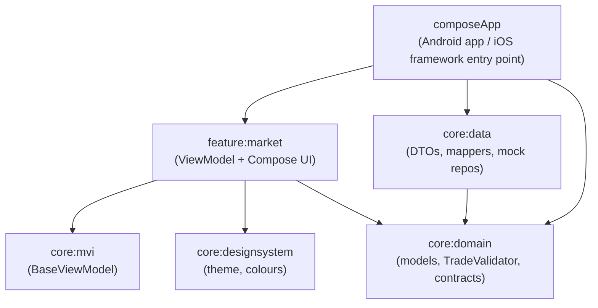
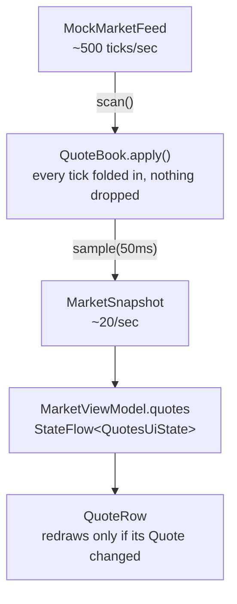
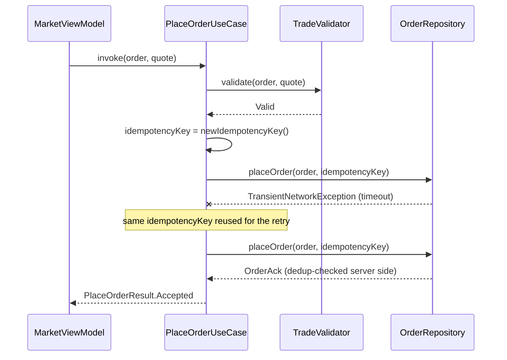

# ADR-001: Architecture for the Market Insights & Execution module

**Status:** Proposed  
**Author:** Swati Kaknale  
**Audience:** Product, UX, Backend Architecture

## Context

We need one module, live on both Android and iOS, that shows a genuinely high-frequency
feed (hundreds of updates/sec around market open) of bond yields and equity prices,
alongside analyst research calls and a trade ticket. Built by one team, one codebase if we
can manage it. In order of what matters most: the money has to be exactly right, it has to
stay smooth when the market's busy, and we can't afford to build this twice.

## Decision

**Compose Multiplatform + Kotlin Multiplatform.** UI, state, and business rules all shared.
Platform code is basically just the entry point - MainActivity vs a
ComposeUIViewController wrapper - plus whatever genuinely has to be native later
(biometrics, secure storage).

**Clean Architecture, enforced by the module graph rather than by convention.**

`core:domain`'s build script has zero dependency on `core:data` - not "shouldn't", the
build script simply doesn't put it on the classpath, so a UI-layer class reaching into a
repository implementation is a compile error, not a code-review catch. I only wrapped logic
in a use case where there's actual logic (`PlaceOrderUseCase`) - most "use cases" here would
just be pass-throughs to a repository and I didn't want ceremony that doesn't do anything.

**MVI-ish, one-way data flow.** Immutable state, Intents in, one-off effects (snackbars) out
through a separate channel so they don't replay on rotation. Side benefit beyond
testability: if a trader disputes what they saw before an order went through, it's
reconstructable, state is just a function of the intents that came in.

**Money is a Long + scale, never a Double.** No float drift, every price check happens
against an exact value on the exchange's tick grid, formatted with Indian grouping since
that's what our traders actually read.

## State - two different speeds

Quotes and everything else change at completely different rates, and I didn't want to
pretend otherwise.

Quotes are the fast lane. Every tick gets folded into an in-memory book off the main
thread, but the UI only gets a fresh snapshot every 50ms - about 20/sec, roughly the limit
of what's visually trackable anyway. Nothing's actually lost (every tick still updates the
underlying state), what gets skipped is redundant UI frames in between.

Rows that didn't change don't redraw, because they're literally the same object reference
as before, not just equal by value - so "only redraw what changed" is basically free
instead of something hand-rolled per row.

Everything else - selected filter, research loading state, the order ticket - only changes
on user action, so it's a normal StateFlow.

Text being typed (quantity, price) lives in the UI itself via `rememberSaveable`, not the
ViewModel - routing every keystroke through an async StateFlow makes fields feel laggy and
the cursor jumps around.

Also worth flagging: an open ticket now survives the process actually getting killed in the
background, not just a rotation - common on cheaper phones. We don't persist the whole
ticket (most of it isn't easily saveable), just enough to rebuild it - which instrument,
which side - once a live quote comes back after restart.

## Cross-platform memory

K/N on iOS uses a tracing GC now, no more object freezing. Pause time scales with
allocation rate though, and that shows up as dropped frames if you're not paying attention.
We keep the hot path light on purpose - conflating 500 ticks/sec down to 20 cuts UI-facing
allocations by roughly 25x, and the tick-flash animation touches zero new allocations per
frame since it only writes a color during the draw phase.

Where I'd actually want the team careful: the Swift/Kotlin boundary. Objects Swift holds
stay alive until Swift releases them, and a Swift closure capturing `self` that gets handed
into Kotlin is a reference cycle neither GC can see across on its own. Weak captures in
anything crossing that boundary, tie stream collection to view lifecycle, `autoreleasepool`
around anything allocating a lot of Obj-C objects in a loop.

Don't guess at any of this, profile it - Instruments + K/N's GC logging on iOS,
profiler + LeakCanary on Android. There's a concurrent-marking GC option in K/N we haven't
turned on, want to benchmark it behind a flag before committing rather than flip it and
hope.

## API contract, error handling, and retry

Everything in this repo talks to mock repositories rather than a real backend, but they're
built to the same contract shape a real HTTP client would follow, and the retry/idempotency
logic described here is real, working code (`core/domain/util/RetryPolicy.kt`,
`core/domain/order/PlaceOrderUseCase.kt`, `core/data/repository/MockOrderRepository.kt`,
`MockResearchRepository.kt`) - not just a diagram of intent.

### Error classification

Every failure this app can encounter falls into one of three buckets, and each bucket gets
a different response:

| Category | Example | What we do |
|---|---|---|
| Validation / rejection | Order below the price band, quantity not a lot multiple | Never retried - `TradeValidator` catches these before a network call is even made. Shown to the user immediately as a specific, actionable violation. |
| Transient (`TransientNetworkException`) | Timeout, connection drop, a 5xx-equivalent | Retried with exponential backoff, up to a fixed attempt cap. |
| Permanent / unexpected | Malformed response, an error type we don't recognize | Not retried. Surfaced as a generic failure (`ResearchState.Failed`, `PlaceOrderResult.Failed`) rather than silently swallowed or endlessly retried. |

The distinction matters because retrying the wrong bucket is actively harmful: retrying a
validation rejection just delays telling the user what to fix, and retrying an unrecognized
error blindly can turn one weird failure into three.

### Retry policy

`RetryPolicy` (exponential backoff + jitter) is shared code, used two different ways
depending on whether the underlying call is safe to repeat:

- **Reads retry themselves, inside the data layer.** `MockResearchRepository` wraps its own
  simulated call in `retryWithBackoff` - a read has no side effect, so there's no reason the
  caller (the ViewModel) needs to know a retry even happened.
- **The one mutating call - placing an order - has its retry decision made in the domain
  layer**, by `PlaceOrderUseCase`, not the repository. That's deliberate: knowing "this
  specific retry is still the same logical order, not a new one" is a business rule, not a
  transport detail, so it belongs next to `TradeValidator`, not buried in the data layer.

Defaults: 3 attempts, starting at 200-300ms, doubling each time, capped at 2s, ±20% jitter
so a batch of clients recovering from the same outage don't all retry in lockstep.

### Idempotency - why retrying an order placement is normally dangerous, and how this avoids it

Retrying a GET is free. Retrying a POST that creates an order is not - if the first attempt
actually succeeded and only the *response* got lost (a very common failure mode, not a rare
edge case), a naive retry creates a second, real order. This is exactly the kind of bug that
looks fine in every demo and then costs real money in production.

`newIdempotencyKey()` is generated exactly once per Submit tap, before any network call, and
the same value is threaded through every retry attempt. `MockOrderRepository` checks that
key against orders it's already acknowledged *before* doing any work - if the key's been
seen, it returns the existing `OrderAck` instead of creating anything new. A real backend
would do the same check server-side (that's the actual point of an idempotency key -
protecting against duplicate requests the client can't fully control, like a proxy retrying
a request the client itself only sent once).

### What this doesn't cover yet

The live market feed (`MockMarketFeed` / `DefaultMarketRepository`) doesn't have
reconnect-with-backoff logic, because it never actually fails in its current mock form. A
real WebSocket feed would need this at the `Flow` level - most naturally as a `Flow` that
catches a disconnect and re-subscribes with backoff, replaying from the last acknowledged
sequence number (`Tick.sequence`) so a reconnect doesn't silently lose or duplicate ticks.
Circuit-breaking (stop retrying entirely after N consecutive failures, until a cooldown
passes) is also not implemented - worth adding once there's a real backend to observe actual
failure patterns against, rather than guessing at thresholds now.

## For Product

One codebase means features land on both platforms in the same release instead of two
teams drifting apart. Shared `TradeValidator` means pre-trade rules can't diverge between
platforms - compliance changes a rule once, it's tested once. `FixedPoint` instead of
`Double` means no rounding mismatches against the exchange or back office, fewer
reconciliation headaches. The conflated feed keeps things smooth on a mid-range phone
during a volatile open without burning through battery/data faster than anyone can
actually read the updates. The idempotency key on order placement means a flaky connection
during a trade never risks a duplicate order - that's not a nice-to-have for a brokerage,
it's the kind of bug that shows up as a support escalation and a compliance conversation.

I'd rather measure this after a couple of sprints - cycle time, crash-free rate, how far
Android and iOS drift apart feature-wise - than promise numbers now.

## Asks

Backend: sequence numbers on every tick so gaps after a reconnect are detectable, prices as
scaled integers or decimal strings (never raw floats over the wire), and please
re-validate everything server side - our client checks are for responsiveness, not
authority. Server timestamps too, staleness checks need something real to compare against.

UX: agree on a visual update cap (targeting ~20/sec/row, more than that just reads as
flicker), how long the price flash should run (450ms is our starting guess), and please run
the up/down palette through an accessibility check - we're pairing color with glyphs, but
want that confirmed properly.

## What we didn't pick

Compose Multiplatform on iOS is younger than SwiftUI, especially text input and
accessibility polish. If a screen needs native-level fidelity we can rebuild just that
screen in SwiftUI while still calling the same shared Kotlin - the `TradeValidator` Swift
interop in this repo is a working example of that path already.

Considered and passed on: fully native UI on both platforms sharing only the Kotlin logic
(doubles UI work, kept as a fallback for individual screens rather than the default);
Flutter (throws away the team's Kotlin/Android depth for no real upside here); separate
StateFlows per piece of screen state instead of one MVI object (harder to reason about
consistency once more than one thing can change at once).
